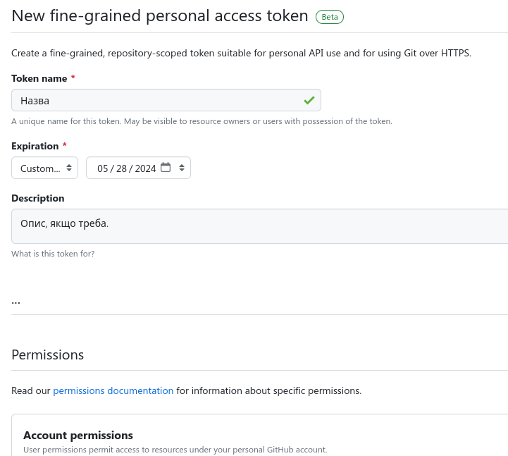

# Авторизація на GitHub через Git

**Починаючи з 13 серпня 2021 року, GitHub більше не приймає звичайні паролі від облікових записів для аутентифікації та проведення операцій з GitHub через Git,** _тому необхідно вміти створювати Токени (новий спосіб) та використовувати їх._

### Створення Public Access Token (PAT)

Перейдіть на сайт [GitHub](https://github.com/) і війдіть у свій акаунт. В правому верхньому кутку натисніть на зображення профіля, а потім виберіть "Налаштування":

Там необхідно вибрати вкладку "Налаштування Розробника":

У відповідній вкладці Персональних Токенів Доступу натисніть "Сгенерувати новий токен":

Тут потрібно налаштувати токен під свої потреби:

- Вибрати назву (практично не знадобиться, тому будь-яку)
- Термін дії, після якого токен буде видалений (можна й назавжди)
- Дозволи — вибрати, до яких функцій та даних можна дістати доступ через токен

Для звичайних дій у рамках шкільної програми, я думаю, можна вибрати все, окрім видалення (щоб не було "випадковостей" c;) для `repo`.
_Важливо:_ хоча доступ до всіх дій та даних не рекомендується надавати з метою забезпечення безпеки користувача!

Коли Ви закінчили, натисніть на кнопку створення у кінці сторінки:

Сгенерований токен з'явиться на екрані, потрібно його скопіювати і десь зберегти або, як мінімум, сфотографувати.

**Це дуже важливо,** _адже подивитися токен можна лише один раз! Зберігайте токен у безпечному місці й нікому не давайте, адже він працює як пароль._

У будь-який час також можна зайти у цю ж вкладку і вручну видалити токен до закінчення терміну дії, натиснувши відповідну кнопку "Delete".

